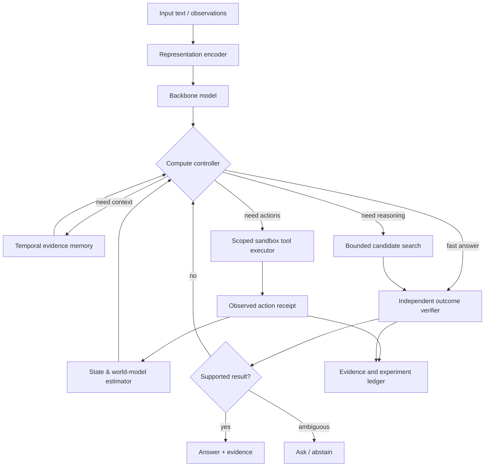

# Candidate next-generation AI: modular, testable specification
**Design status:** original synthesis and hypotheses. **Not implemented, validated, or a claim of general intelligence.**

## Why design in replaceable parts?
Large language models already combine pretraining, posttraining, prompt scaffolds, tools, retrieval, hardware and evaluators. Improvements attributed to "smarter model" may be cheaper search or fresher documents. This design makes attribution explicit.

## Backbone baseline and architecture candidates
Start with a small **open-weight decoder Transformer** baseline (fully pinned revision, legal license and training data). Evaluate **dense attention** first; do not presume a fancy architecture is a win. Optional later swaps:
- MoE FFN for capacity under fixed active FLOPs (DeepSeek/Qwen/Olmo-core research);
- partial selected attention heads plus recurrent layers for long-context compute (ICML 2026);
- byte patcher for robustness to arbitrary text/binary-like sequences (Bolmo 2026);
- DLM denoising for output families benefiting from parallel refinement (Sigma/Clock 2026).

These are *competing* hypotheses, not stages to all integrate at once. Each alternate must first beat a strong baseline in isolated experiments.

## The five independent learning channels
1. **Weight learning:** SGD/RL updates to model parameters through verified objectives. Version and roll back independently.
2. **Retrieval updates:** new authorized documents and embeddings; provenance and freshness matter.
3. **Episodic memory:** actual action outcomes with time and source.
4. **Procedural skills:** learned tool affordances/action selection under deterministic external checks.
5. **World knowledge:** abstract state-transition models trained from observed environment feedback, with uncertainty.

Any improvement must identify its channel. A bigger external knowledge store is not evidence that language-model weights learned.

## Control policy candidate H01+
A lightweight decision controller selects one of:
- **DIRECT**: low-risk known question, calibrated high-confidence;
- **RETRIEVE**: external source required or fact may have changed;
- **DELIBERATE**: deterministic/verifiable hard problem, bounded reasoning budget;
- **ACT**: authorized and reversible environment action;
- **ASK / ABSTAIN**: ambiguity, uncertain evidence or unacceptable risk.

Proposed controller feature inputs: confidence estimate, past verifier agreement, task category, expected reward/value of information, costs, deadline, memory freshness and safety permissions. Decision objective could be expected verified utility minus time/cost/safety penalties.

**What must be measured:** gain over fixed fast, fixed elaborate and always-retrieve baselines at equal average and p95 compute. A sophisticated router with no measurable gain should be removed.

## Memory design
Temporal evidence ledger (see [memory dossier](13-memory-world.md)), separate user-provided claims from external observed facts. Supersede rather than quietly mutate ordinary facts; honor deletion of personal data. Retrieve multiple candidate evidence items plus provenance, then reconcile. Test latest/earlier time scopes and unknowns.

## World-action loop
A modeled transition should say **what is predicted**, **why**, **confidence**, and **what actual action response would falsify it**. Tool executor is independently permissioned; an LLM prediction is not an action receipt. Sandbox world tasks must separate known/unknown mechanisms and have hidden held-out generators.

## Decision table for first engineering phase
| Component | Implementation order | Proof needed |
|---|---:|---|
| Reference backbone and exact task evaluator | 1 | Reproducible baseline with licensed model/data |
| Temporal event ledger with source IDs | 2 | Synthetic time queries and permission tests |
| Independently checked answer validation | 3 | Low false-negative/false-positive checks on hidden data |
| Budgeted controller direct/retrieve/search | 4 | Measured Pareto gain over fixed policy |
| Tool-action executor (sandbox only) | 5 | Receipts, recovery, no unapproved actions |
| World transition learner | 6 | Held-out task transfer, calibrated rollouts |
| Architecture swap (SSM/MoE/byte/DLM) | 7 | Matched-quality compute/latency advantage |
| Training on interaction outcomes | 8 | No reward hacking and transfer to unseen mechanics |

## Risk register
- **Benchmark leakage:** test data/paper samples show up in training. Fix by task-family splits.
- **Misattribution:** gains from harness rather than backbone. Fix with layer ablations.
- **Reward hacking:** learned policy games verifier. Fix independent hidden checker and human audits.
- **False memory:** memories stale/misattributed. Fix provenance and time reconciliation.
- **World-model exploitation:** planner finds model errors. Fix actual-environment rollouts and uncertainty bounds.
- **Compute waste:** exotic architecture underperforms. Fix smallest representative tests before scale-up.
- **Authority creep:** agent takes actions outside scope. Fix external permissions and reversible sandbox.

## Success criteria
A candidate advances only after at least two reproducible runs on independently held-out tasks showing a meaningful prespecified benefit (capability, reliability or efficiency), with uncertainty and no significant harmful regressions. If gains remain confined to a narrow task, accurately describe that task-specific advance instead of calling the model "next best LLM."

## Research-oriented roadmap
**Quarter-scale stages are illustrative, not promised delivery dates:** evidence review → minimum reproducible baseline → inference/memory ablations → task transfer → architecture alternatives → training changes. Available hardware and datasets are unknown and must be assessed before setting durations or budgets.
