# AI field map — one research atlas beyond LLMs
**Pass 4, October 8 2026.** The source catalog now holds **146** records across **25** tracks. This is a curated starting reference, not a comprehensive count of AI research or independently validated findings.

## One-page taxonomy

```mermaid
flowchart TD
    AI[Artificial intelligence] --> FM[Foundation models]
    AI --> CL[Causal / symbolic / statistical reasoning]
    AI --> CTRL[Control, RL and agents]
    AI --> SYS[Hardware, algorithms and systems]
    AI --> G[Governance, safety and evaluation]
    FM --> DATA[Datasets, objectives, pretraining]
    FM --> ARCH[Architecture and representation]
    FM --> PT[Posttraining, reasoning, search]
    FM --> MM[Multimodal encoders/generation]
    CL --> CAUSE[Causal variables and interventions]
    CL --> SYMBOL[Formal verification and program synthesis]
    CTRL --> MEMORY[Continual and external memory]
    CTRL --> WORLD[World modeling and planning]
    CTRL --> EMB[Robotics and embodied action]
    SYS --> HPC[Distributed training and inference]
    SYS --> EFFIC[Compression and adaptation]
    G --> I[Mechanistic interpretability]
    G --> ALIGN[Alignment, control, monitoring]
    G --> EVAL[Contamination-resistant evaluation]
    PT --> SCI[AI-assisted scientific discovery]
    WORLD --> SCI
    SYMBOL --> SCI
```

## Foundational research track map (18 prior tracks): question → tools → proof
| Track | Fundamental question | Mechanism / tools to learn | Measurable progress | Current coverage |
|---|---|---|---|---|
| Foundations | How are representations optimized? | Gradients, cross entropy, SGD, backprop, information theory | Reproduce a basic model and its loss | Introductory; extend classics |
| Data | Which experiences matter? | Dataset curation, dedup, mixtures, synthetic data, curriculum | Better held-out performance per FLOP | Source-rich, no local training |
| Architecture | Which inductive bias is best? | Attention, MoE, recurrence, SSMs, diffusion, byte patches | Matched-compute quality and throughput | Many papers, no architecture ablation |
| Reasoning | When does computation improve correctness? | SFT, DPO, RL, proof checking, candidate search | Verified accuracy vs inference cost | Strong proposals, no real eval |
| Memory | How is knowledge revised and used later? | RAG, episodic state, temporal queries, selective updates | Less stale recall, better tool choices | Deterministic fixture only |
| Agents | How are goals turned into reliable action? | Tool invocation, planning, execution receipts, recovery | Higher hidden-task success by horizon | Source survey, no live agent test |
| World models | Can learned dynamics improve decisions? | Transition models, MPC, curiosity, uncertainty | Transfer to unseen rules and mechanisms | Procedural experiment plan |
| Multimodal | How is information grounded across media? | Visual/audio/video embeddings, aligned objectives | Counterfactual multimodal grounding | Introductory |
| Systems | Which hardware/software choices control cost? | FlashAttention, vLLM, MoE comms, adapters | Quality per dollar/latency/joule | Several strong sources |
| Evaluation | What is really being measured? | Heldouts, psychometrics, cost matching, cheating audits | Predictive validity on unseen tasks | Broad benchmarks, lacks run harness |
| Safety | What failure conditions need controls? | Threat modeling, guardrails, trusted evaluators | Lower severe error rate at same usefulness | Baseline notes |
| Interpretability | Which internal variables cause behavior? | Sparse autoencoders, attribution, probes, interventions | Intervention generalization, audit utility | New 2026 dossier |
| Causality | How can state support interventions? | Structural causal models, invariance, do-calculus | OOD intervention prediction | New 2026 dossier |
| Continual learning | Can weights learn without forgetting? | EWC, replay, adapters, task-inference | Retention/plasticity curves | Seed foundations only |
| Security | Can model/data access leak or be subverted? | Memorization audit, prompt injection, provenance | Less leakage and boundary crossing | New privacy/security primer |
| Alignment | Can goals and behavior remain controlled? | Preference learning, constitutional feedback, monitorability | Alignment under domain/role shifts | New 2026 dossier |
| Robotics | Can models safely act in changing environments? | VLA, RT-X, action diffusion, sim2real | Unseen task success and intervention safety | New physical AI dossier |
| Science | Can AI discover externally checkable knowledge? | Candidate generation, Lean, evolutionary search, expert review | Independently verified novel results | New 2026 dossier |
| Hardware | Which compute architecture limits training/serving? | Accelerators, memory bandwidth, interconnect, MLPerf | End-to-end measured efficiency | New benchmark dossier |

**Coverage is not the same as completeness.** Future catalog additions may require new tracks or hierarchical tags. Single-track assignments are a simplified primary-category index; links across domains matter and are captured below.

## Pass 4 new primary research tracks (7)

| Added area | Core question | Sources and synthesis | Proposed discriminator |
|---|---|---|---|
| Probabilistic uncertainty | How can confidence correspond to real correctness? | [Calibration and Bayesian methods](31-bayesian-calibration.md) | E23 Brier/NLL and selective risk under source shift |
| Formal reasoning | Can generated arguments be trusted and independently checked? | [Graph & proof dossier](32-graph-formal-reasoning.md), [full proof audit](30-deepseek-prover-v2-review.md) | E24 trusted proof validity and intended theorem fidelity |
| Graph learning | What can explicit relations generalize to that strings cannot? | [GNN inductive bias and expressivity](32-graph-formal-reasoning.md) | E25 held-out graph structures and edge interventions |
| Audio | What speech information is absent from transcripts? | [Audio models and data](33-audio-neuroscience.md) | E26 acoustically grounded tasks, noise and streaming cost |
| Brain-inspired computation | Do active-inference objectives improve adaptive behavior? | [Active inference and neuroscience](33-audio-neuroscience.md) | E27 task utility vs interaction budget, not novelty alone |
| Program synthesis | Does library learning produce reusable algorithms? | [DreamCoder and symbolic code](32-graph-formal-reasoning.md) | E24b compositional program generalization |
| Multi-agent coordination | When does communication improve rather than correlate errors? | [Debate and MARL](34-multiagent-reliability.md) | E28 same-cost independent candidates vs debate under persuasion |

The Mermaid at the top is a **high-level thematic view**, not one node per catalog track.

## Cross-domain pathways worth following
1. **Interpretability → causality → safety:** use representation maps to propose interventions, then test whether they actually predict and prevent failures on held-out input.
2. **World models → embodied robotics → agents:** learn transitions, plan under uncertainty, execute scoped actions, verify against observed outcomes.
3. **Reasoning → math/proofs → scientific discovery:** proposals from a generator become knowledge only after proof-checking, replication and expert scrutiny.
4. **Scaling laws → architecture → hardware:** a low training loss does not guarantee lowest inference cost; design should optimize deployed system cost and quality jointly.
5. **Memory → continual learning → data:** externally stored events and changes to network weights are separate learning mechanisms, with different failure and privacy conditions.
6. **Multimodal → self-supervision → causal state:** video prediction can discover useful motion structure; evaluate whether it supports interventions rather than mere resemblance.

## Reading order (engineer seeking research depth)
**Week-sized stages are themes, not a promised schedule:** mathematical fundamentals → training/model recipes → competing architectures → RL and inference search → memory/world models → evaluation/safety → interpretation/causality → robotics and scientific research. Keep a paper-reading record and reproduction notebook for each selected source.

## Gaps deliberately visible
Coverage remains preliminary in probabilistic programming (beyond calibration), GNN heterophily and over-squashing, evolutionary computation, neural ODEs, computational neuroscience experiments, neurosymbolic systems, audio-native streaming data, 3D reconstruction, privacy law, multi-agent RL credit assignment, cyber/AI risk quantification and genuinely verified theorem-proving replicas. These remain [Pass 5 research priorities](37-pass5-handoff.md); don't mistake added source coverage for mastery or full systematic review.

## Evidence rule
An abstract, model announcement or headline is an E1 research lead. A complete technical review is E2. Only actual reproducible and independently measured experiments justify E3+. Our repo currently claims no E3+ result.
