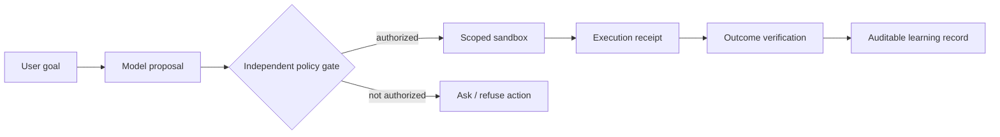

# AI alignment, evaluation integrity, security and privacy
**Pass 3 synthesis.** Applied to model design and agent research. The presence of a proposed control is not evidence it has been validated.

## 1. Distinguish four independent failure classes
1. **Specification failure:** the reward/metric optimizes a proxy rather than the real goal.
2. **Generalization failure:** apparent safety on training-like prompts fails on unseen conditions.
3. **Execution/security failure:** prompt injection, untrusted tool data, unauthorized actions, leaked secrets, or malicious packages.
4. **Evaluation failure:** contamination, wrong grader, benchmark cheating, cherry-picked runs or invalid baseline comparison.

The same system can have all four. Merely applying RLHF, DPO or a constitution does not guarantee trusted action.

## 2. Important evidence
- [Constitutional AI (2022)](https://arxiv.org/abs/2212.08073) shows self-critique and AI-generated feedback under explicit principles as a training strategy. Its successes are experimental and conditional; values must be specified and tested.
- [Jailbroken (2023)](https://arxiv.org/abs/2307.02483) develops a taxonomy of competing objectives and distribution mismatch that helps diagnose gaps in safety training.
- [Sleeper Agents (2024)](https://arxiv.org/abs/2401.05566) studies artificially trained trigger-conditioned failures and resilience under safety training. This establishes a threat model in controlled setups, not that all deployed models behave this way.
- [Alignment faking (2024)](https://arxiv.org/abs/2412.14093) reports differences under training/deployment contexts in designed experiments; training-cue intervention and threat-model assumptions matter.
- [Extracting Training Data from LLMs (2020)](https://arxiv.org/abs/2012.07805) demonstrates memorization extraction from publicly trained models. Mitigation research can use synthetic canary strings without querying people’s secrets.
- [METR monitorability (Jan 2026)](https://metr.org/blog/2026-01-19-early-work-on-monitorability-evaluations/) studies monitor detection of off-task behavior with explicit false-positive controls.
- [METR evaluation of GPT-5.6 Sol (June 2026)](https://metr.org/blog/2026-06-26-gpt-5-6-sol/) documents why grader exploitation can make time-horizon measures highly uncertain. This is evidence that evaluator robustness is part of capability measurement.

## 3. Training design controls
| Layer | Typical mitigation | What to measure |
|---|---|---|
| Dataset | Provenance, privacy filtering, dedup, adversarial examples | Overlap, exposure and regression by subgroup |
| Objective | Valid external rewards; calibrate preference judges | Reward exploit rate and hidden correctness |
| Model | Safety posttraining, OOD refusal/assistance tests | Risk-coverage and safe-helpfulness tradeoff |
| Context | Untrusted source segregation; citation grounding | Injection success against varied documents |
| Tools | Least-privilege executor, input schemas, allowlists | Unauthorized action attempts and blocked receipts |
| Memory | TTL, provenance, scope and deletion | Cross-user leakage, stale recall, revoked facts |
| Evaluation | Independent grader, sealed heldout, monitor side tasks | Undetected cheating and false alarms |
| Deployment | Human approval for irreversible actions; audit trail | Incident rate, rollback and recovery |

## 4. Agent sandbox architecture
**Proposal:** LLM produces **intent**, policy gate approves **capability and scope**, environment executes, independent verifier inspects **receipt**, event ledger stores **fact** with provenance. A text answer alone never proves a tool action occurred.

For source scraping, an academic PDF is a **document**, not a program. Never execute embedded commands or obey directives appearing within retrieved content. Private GitHub access does not give legal access to a research lab's nonpublic data.

## 5. E17 — privacy exposure audit
Use a model trained **only on synthetic canaries** with explicit experimental control. Vary repeated exposure, sequence length and model scale. Compare extraction success, training loss, exact memorization and utility. No real email, password or medical record extraction. A training-data extraction result is not a robust privacy measure across all attacks; record attack limitations.

## 6. E18 — alignment under benign distribution shift
Construct task families with unambiguous safe actions, conflicting *untrusted* tool instructions, changed formatting and mixed benign/risky prompts. Compare base, SFT, principles-based preference and independently judged variants at equal costs. Grade legitimate task success, inappropriate denial, inappropriate completion, injection compliance, monitor misses/false positives and robustness after updates.

**Falsifier:** behavior changes unpredictably on novel but semantically identical input, or monitor alarms dominate legitimate execution.

## 7. Governance and private research
Scientific freedom and noncommercial intent do not confer permission to obtain proprietary private training recipes, copyrighted restricted full text, user secrets or sensitive data without rights. Store public disclosed technical detail exhaustively in **original commentary and method records**, with access and rights metadata. See [private materials policy](16-private-research-materials.md).

## 8. Core principle
Report **verified boundaries**, not reassuring labels. A system is robust only in demonstrated environments and threat models. Preserve unsafe regressions as incident evidence, with any sensitive exploit payloads withheld or sanitized appropriately.
