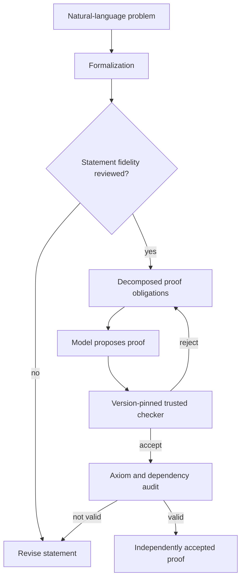

# Graph reasoning, symbolic programs, and formally verified thought

**Research level:** reviewed source abstracts, one full-paper DeepSeek-Prover-V2 audit. No local learned-graph or Lean model results.

## Why sequence prediction is not all of reasoning

Many environments have natural **objects**, **relations** and **rules**. Transforming a relational environment into a plain token stream may still allow a powerful language model to solve it, but often imposes a greater learning burden and can obscure data provenance. Graph networks explicitly encode edges; symbolic programs explicitly encode operations; proof checkers explicitly enforce formal semantics. The relevant question is not "which is smarter?" but "which bias lowers compute and errors under what task distribution?"

## A. Graph neural networks
For graph nodes V and edges E, a message passing layer can be described as:
`h_v^(l+1) = U_l(h_v^l, AGG_{u in N(v)} M_l(h_v^l, h_u^l, e_uv))`.
Neighborhood aggregation must respect node permutation invariance/equivariance for conventional node graph tasks.

| Method | Inductive bias | Main strength | Failure mode | Source |
|---|---|---|---|---|
| GCN | Normalized neighborhood mixing | Efficient semi-supervised graph smoothing | Homophily assumptions; oversmoothing | [Kipf & Welling](https://arxiv.org/abs/1609.02907) |
| GAT | Neighbor attention | Learned relative importance among neighbors | More parameters, unstable on noisy/high-degree graphs | [Graph Attention Networks](https://arxiv.org/abs/1710.10903) |
| GIN | Expressive multiset aggregation | Connection to Weisfeiler-Lehman discrimination | Still bounded by message-passing expressivity | [How Powerful are GNNs?](https://arxiv.org/abs/1810.00826) |
| General graph networks | Typed entities and interactions | Relational / compositional bias | Manually determined graph semantics can be wrong | [Relational Inductive Biases](https://arxiv.org/abs/1806.01261) |

**Critical limitation:** some distinct graph structures cannot be distinguished by standard message-passing GNNs. A graph that encodes a causal process incorrectly can make learning *worse*. Don't replace a language model with a GNN by default; integrate graph reasoning only where objects/relations matter.

**E25 test:** generate small graphs and questions: reachability, edge label transitivity, distractor subgraphs, unseen node renamings, changed edge direction, physically plausible mechanism combinations. Compare exact symbolic solver, GNN, text-only model and hybrid graph→LM at equal supervision/budget; evaluate OOD graph size and intervention effects separately.

## B. Program synthesis learns executable concepts

[DreamCoder](https://arxiv.org/abs/2006.08381) learns reusable symbolic subprogram abstractions and recognition-model search guidance. Its wake-sleep structure can be understood as:
1. **Wake:** search candidate programs explaining observed examples using a language library.
2. **Abstraction:** compress successful programs into reusable components.
3. **Sleep:** train recognition/search guidance on generated or replayed tasks to exploit new concepts.

It is an important alternative to storing every solution as unconstrained text: learning a **reusable executable abstraction** can support composition and interpretability. Trade-offs include program-search cost, choosing the DSL, ensuring semantics, and avoiding over-compression of rare behaviors.

**E24b test:** synthesize short integer/string transformations from examples; split by *composition of operations*, not just random inputs. Compare fixed DSL enumerator, library with discovered reusable components, neural-only predictor, and library+learned guide. Grade execution on hidden inputs, program complexity, search budget and novelty.

## C. The proof assistant is an independent judge—not an oracle on problem formulation

[LeanDojo](https://arxiv.org/abs/2306.15626) exposes theorem states, premise retrieval and interactive proof environments. [DeepSeek-Prover-V2](30-deepseek-prover-v2-review.md) pairs informal subgoals, recursive Lean proofs, synthetic curricula and reward-guided optimization. The July 2025 revised report documents a flawed `apply?` tactic interface and changed benchmark counts. We must protect **model validity**, **checker validity**, and **specification validity** separately.

### 2026 research developments
- [ICML 2026 interleaved formal verification](https://proceedings.mlr.press/v306/cao26y.html): feeds symbolic checks into reasoning/training earlier than final answer.
- [Formal Problem-Solving](https://proceedings.mlr.press/v306/liu26gl.html): requires generating a witness and proving it, not just proving an already stated answer.
- [Formal Specification Quality](https://proceedings.mlr.press/v306/yang26am.html): a generated specification may itself be inaccurate even if a prover checks it.
- [Proof-data selection and verifier feedback](https://proceedings.mlr.press/v306/zhu26u.html): selects mathematically meaningful data dimensions.
- [miniF2F-Dafny](https://proceedings.mlr.press/v306/baksys26a.html): auto-active theorem proving can solve some benchmark problems without a model, so credit the verifier separately.

## D. E24 — a cost-matched verification experiment
**Control:** exact same model and external tool budget. **Variants:** direct answer; final-only verifier; incremental proof-check; subgoal planner plus verifier; complete witness/proof generator. **Primary:** formally correct and intended result on hidden new problem families, not superficially accepted Lean tokens. **Secondary:** formalization mistakes, invalid axioms, proof steps/call count, p95 latency and hallucinations.

**Falsifiers:** verifier bugs explain gains; model merely copies canned lemmas; correct proofs depend on supplying the right answer; model-plus-tool underperforms a pure symbolic solver on its target task.

## E. When to integrate with an LLM architecture
A reasonable **hypothesis**, not a proven new general model:
- LM parses messy language and suggests state transformations;
- typed graph/state solver maintains explicit relations;
- symbolic search generates executable programs or proofs;
- model evaluates alternatives at a cost budget;
- independent checker and observed environment determine success;
- verified skill library and provenance-aware memory retain reusable results.

Competing baseline should be the same LM with RAG/tool calling and a strong search policy, not a deliberately crippled text-only agent.
